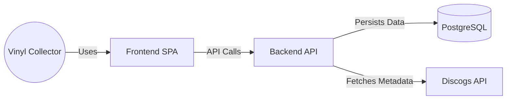

# Arc42 Architecture Documentation: Vinyl Tracker (AntiGrafity)

This document describes the software architecture of the **Vinyl Tracker** (AntiGrafity) application. It follows the [Arc42 template](https://arc42.org/).

## 1. Introduction and Goals

The **Vinyl Tracker** is a personal web application designed for vinyl enthusiasts to catalog their record collection and track listening habits.

### 1.1 Requirements Overview
- **Catalog Management**: Users can scan barcodes on vinyl records to automatically retrieve metadata (via the Discogs API) and add them to their personal collection.
- **Listening History**: Users can log when they listen to a record, creating a history of their listening habits.
- **Listening History Maintenance**: Users can explicitly delete individual listen events or reset their complete listening history from the Settings area.
- **Analytics**: Users can view statistics about their most played records and listening trends over time.
- **Collection Insights**: Dashboard provides Discogs collection value estimation and genre distribution from live analytics endpoints.
- **Multi-User**: Supports multiple users, each with their own collection and Discogs integration.
- **Mobile Friendly**: Designed as a Progressive Web App (PWA) with fully responsive layouts, fluid scrolling, and safe area support for iOS. Features camera access for barcode scanning.
- **QR Code Generation**: Ability to export the collection as a printable PDF with QR codes for physical tagging.

### 1.2 Quality Goals
- **Maintainability**: High test coverage (>80%) and modular code structure.
- **Usability**: Responsive, modern, and aesthetically pleasing UI with intuitive interactions (glassmorphism, micro-animations, informative empty states).
- **Privacy**: Self-hosted solution where user data remains under their control; Discogs tokens are encrypted.
- **Reliability**: Robust handling of external API failures (Discogs) and database integrity.

### 1.3 Stakeholders
- **Users**: Vinyl collectors who want to organize their collection and see listening stats.
- **Developers**: Contributors maintaining and extending the open-source project.

## 2. Architecture Constraints

- **Technology Stack**:
    - **Backend**: Java 25+ (Spring Boot 4.0+).
    - **Frontend**: Angular 19 (TypeScript).
    - **Database**: PostgreSQL 16.
    - **Caching & Resilience**: Caffeine, Resilience4j.
    - **Migrations**: Flyway.
    - **Containerization**: Docker & Docker Compose.
- **License**: MIT License (Open Source).
- **Deployment**: Self-hosted via Docker Compose.
- **Browser Constraints**: Requires HTTPS (or localhost) for webcam access (Barcode scanning).

## 3. System Scope and Context

### 3.1 Business Context
The system acts as a personal catalog and usage tracker.
- **User**: Interacts with the Frontend via Browser/Mobile.
- **Discogs API**: External system used to fetch metadata (Artist, Title, Year, Cover Art) based on barcodes or search queries.

**Context Diagram**:

### 3.2 Technical Context
- **Protocol**: HTTP/HTTPS (REST).
- **Format**: JSON, PDF (for exports).
- **Security**: JWT-based authentication with backend-managed HttpOnly cookies as primary mechanism and Bearer header fallback for constrained environments; BCrypt password hashing and AES encryption for Discogs API tokens.

## 4. Solution Strategy

- **Micro-Architecture**: Separation of Frontend (SPA) and Backend (REST API) to allow independent scaling and technology evolution.
- **Container-First**: The entire application is packaged as Docker containers to ensure consistent environments from development to production.
- **External Integration**: Rely on Discogs for rich metadata instead of building a proprietary database.
- **Resilience Strategy**: Use Resilience4j to strictly adhere to Discogs API rate limits (60 requests per minute) and handle transient network issues via smart retries.
- **Caching Strategy**: Implement Caffeine-based local caching for frequently accessed, static metadata (e.g., release details) to reduce external API dependency and improve latency.
- **Testing**: rigorous automated testing (Unit & Integration) enforced by CI pipelines.

## 5. Building Block View

### 5.1 Level 1: Whitebox Overview

The system consists of three main containers:

| Building Block | Description | Technology |
| :--- | :--- | :--- |
| **Frontend** | Single Page Application handling UI, routing, and device integration (Camera). | Angular 19, Tailwind CSS, html5-qrcode |
| **Backend** | Core business logic, API endpoints, schedulers, and database interactions. | Java 25, Spring Boot, Spring Data JPA, Lombok |
| **Database** | Persistent storage for users, records, and listening events. | PostgreSQL 16, Flyway |

### 5.2 Level 2: Backend Internals

The Backend follows a layered architecture:

- **Controller Layer**: Handles HTTP requests (`ScanController`, `AppUserController`, `AnalyticsController`, `CollectionController`).
- **Service Layer**: Business logic and orchestration (`ScanService`, `DiscogsApiClient`, `CollectionQueryService`, `CollectionSyncService`, `TokenEncryptionService`, `QrCodeService`, `PdfService`). `ScanService` is responsible for both creating listen events and bulk-deleting all listen events for the authenticated user.
- **Repository Layer**: Data access interface (`RecordRepository`, `ListenEventRepository`, `AppUserRepository`). `ListenEventRepository` provides user-scoped queries for recent history, analytics aggregation, and bulk deletion.
- **Model Layer**: Domain entities (`AppUser`, `Record`, `ListenEvent`).
- **DTO Layer**: Request/response payloads are modeled with explicit DTO classes instead of generic maps. Example: scan responses use `ScanDto.Result`, and bulk history reset uses `ScanDto.ResetResult`.

## 6. Runtime View

### 6.1 Scenario: Scanning a Record
1.  **User** opens the scanner on the Frontend.
2.  **Frontend** accesses the camera and decodes a barcode.
3.  **Frontend** sends the barcode to `POST /api/scan`.
4.  **Backend** checks if the user has a linked Discogs account.
5.  **Backend** decrypts the user's Discogs token.
6.  **Backend** calls the **Discogs API** with the barcode.
7.  **Discogs API** returns release data.
8.  **Backend** returns the metadata to the Frontend.
9.  **User** confirms adding the record.
10. **Backend** saves the `Record` to the Database.

### 6.2 Scenario: Listening to a Record
1.  **User** selects a record from their collection.
2.  **User** clicks "Play".
3.  **Backend** receives `POST /api/records/{id}/listen`.
4.  **Backend** creates a new `ListenEvent` with the current timestamp.
5.  **Backend** updates the `playCount` and `lastPlayed` fields on the `Record`.

### 6.3 Scenario: Generating QR Codes
1.  **User** clicks "Download QR Codes PDF" in Settings.
2.  **Frontend** requests `GET /api/collection/qr-codes`.
3.  **Backend** fetches User's releases from Discogs.
4.  **Backend** sorts releases by Artist.
5.  **Backend** generates QR codes for each release.
6.  **Backend** compiles a PDF grid.
7.  **Backend** returns the PDF binary.
8.  **Frontend** triggers a file download.

### 6.4 Scenario: Resetting All Listening Events
1.  **User** opens the Settings page.
2.  **User** clicks "Reset All Listens" in the Data Management section.
3.  **Frontend** presents a confirmation dialog because the action is destructive and irreversible.
4.  **Frontend** sends `DELETE /api/scan/all` for the authenticated user after confirmation.
5.  **Backend** resolves the authenticated user from the security context.
6.  **ScanService** loads the user entity and delegates the deletion to `ListenEventRepository`.
7.  **ListenEventRepository** deletes all `ListenEvent` rows belonging to that user in a single bulk operation.
8.  **Backend** returns a typed JSON response containing success state, message, and deleted event count.
9.  **Frontend** displays the result as a success or failure toast message.

## 7. Deployment View

The system is deployed as a multi-container Docker application orchestrated by Docker Compose.

- **Host**: Any machine running Docker (Linux Server, Raspberry Pi, macOS).
- **Network**: Private Docker network `default`.
- **Volumes**: `postgres_data` for database persistence.
- **Configuration**: Environment variables via `.env` file.

**Docker Compose Structure**:
- `postgres`: Database service containing the `vinyl_tracker` data. Includes a robust `pg_isready` healthcheck.
- `backend`: Java application, strictly depends on `postgres` being in a `service_healthy` state to prevent startup failures. Exposed on port 8080.
- `frontend`: Nginx (Production) or Vite Dev Server (Development). Exposed on port 3000/5173.

## 8. Cross-cutting Concepts

### 8.1 Security
- **Authentication**: JWT-based authentication. Backend issues and verifies an HttpOnly auth cookie for normal request flows; frontend additionally supports `Authorization: Bearer` fallback when cookie propagation is not available.
- **Data Protection**:
    - User passwords are hashed with **BCrypt**.
    - Sensitive external tokens (Discogs PAT) are encrypted using **AES-256** (via Spring Security Crypto) with a salt and key defined in environment variables.
- **Dependency Security**: The backend provides an opt-in Maven profile `security-online` that audits dependencies against the Sonatype OSS Index online service during `verify`.

### 8.2 Validation
- Input validation using Jakarta Validation API (`@Valid`, `@NotNull`, etc.).
- Destructive user actions in the UI require an explicit confirmation step before the backend request is issued.

### 8.3 Error Handling
- Global exception handling in Spring Boot (`@ControllerAdvice`) returns RFC-7807 style `ProblemDetail` JSON payloads (including title, detail, status and timestamp) for API errors.
- **Specific Integration Exceptions**: Replaced generic `RuntimeException` throws in the `DiscogsService` with a tailored hierarchy:
    - `DiscogsTokenException` (HTTP 422) for encryption and token-level issues.
    - `DiscogsApiException` (HTTP 502) for external API communication failures.
    - `CollectionSyncException` (HTTP 500) for batch synchronization errors.
- Endpoint-specific failure paths in analytics endpoints are aligned to the same ProblemDetail structure.
- Lightweight success responses for scan-related endpoints are returned as typed DTOs instead of ad-hoc maps, improving schema clarity across backend and frontend.

### 8.4 Observability & Logging
- **Backend Logging**: A global `HandlerInterceptor` tracks HTTP request execution times, final status codes, and implicitly catches and logs thrown exceptions for all `/api/**` endpoints.
- **Frontend Logging**: 
    - **Browser Environment**: Axios HTTP interceptors log request latencies and response statuses transparently into the browser console.
    - **Container Proxy**: The frontend Docker container (Nginx structure and Vite dev-server) intercepts proxy API traffic and logs metrics matching the backend console format for centralized Docker monitoring.

### 8.5 Delivery Workflow
- **Branch Strategy**: The project uses a simplified flow with two main branches: `develop` (for new features) and `main` (for stable releases). Development happens in temporary feature branches that are merged into `develop`.
- **Versioning**: Before merging into `main`, version bumps across the frontend, backend, and documentation are automated via the `./release.sh` script on the `develop` branch.
- **Continuous Deployment (CD)**: Releases are managed via GitHub Releases. Creating a new GitHub Release (e.g. `v1.5.0`) pointing to `main` issues a Git Tag. The GitHub Actions CI pipeline listens to tags matching `v*.*.*`, runs backend tests and the `security-online` dependency audit, builds the frontend and backend Docker Images, tags them appropriately (`latest` and `v1.5.0`), and pushes them to the GitHub Container Registry (GHCR).

## 9. Architecture Decisions

| Decision | Reasoning | Status |
| :--- | :--- | :--- |
| **Java 25 Migration** | Upgraded to Java 25 (LTS) along with Lombok 1.18.44. The previous downgrade to Java 21 LTS is no longer necessary as tools have caught up with the newer LTS release. | Accepted |
| **Angular 19** | Modern, robust framework with signals for reactive state management, service worker support, and standalone components. | Accepted |
| **Tailwind CSS** | Utility-first CSS allows for rapid UI development and consistent design tokens without managing complex stylesheets. | Accepted |
| **PostgreSQL** | Industry standard, robust relational database. Suitable for structured data like catalog entries. | Accepted |
| **Flyway Migrations** | Replaced Hibernate `ddl-auto: update` with Flyway for reliable, versioned schema migrations in production. | Accepted |

## 10. Quality Requirements

- **Test Coverage**: Strict requirement of >80% line coverage for both Backend (JaCoCo) and Frontend (Karma/Jasmine). Enforced by CI/CD.
- **Dependency Hygiene**: Backend dependencies are checked in CI against Sonatype OSS Index; findings are reported to an audit artifact (`ossindex-audit.json`) with the current configuration set to non-blocking (`fail=false`).
- **Test Execution Split**: Unit tests run via Surefire during `test`, while integration tests run via Failsafe during `verify`. This improves local feedback speed while keeping full validation in CI.
- **Responsiveness**: The UI must adapt to mobile screens (< 768px) for usable barcode scanning on phones.
- **Performance**: API responses should be < 200ms (excluding external Discogs calls). Heavily accessed database relationships (e.g. `user_id` on collections, `discogs_id` on records) are backed by explicit B-tree indexes applied via Flyway to prevent query degradation as dataset sizes grow.

## 11. Risks and Technical Debt

- **Discogs Dependency**: The core scanning feature relies heavily on the Discogs API availability and rate limits.
    - *Mitigation*: Implement caching or manual entry fallback (future feature).
- **HTTPS Requirement**: Barcode scanning requires a secure context (HTTPS/localhost).
    - *Mitigation*: `mkcert` workflow documented for local development. Production setup requires a reverse proxy with SSL (e.g., Traefik/Nginx).

## 12. Glossary

- **PWA**: Progressive Web App (web apps that behave like native apps).
- **SPA**: Single Page Application (Frontend architecture).
- **Discogs**: Third-party database for music releases.
- **Barcode**: UPC/EAN code on the back of vinyl records.
